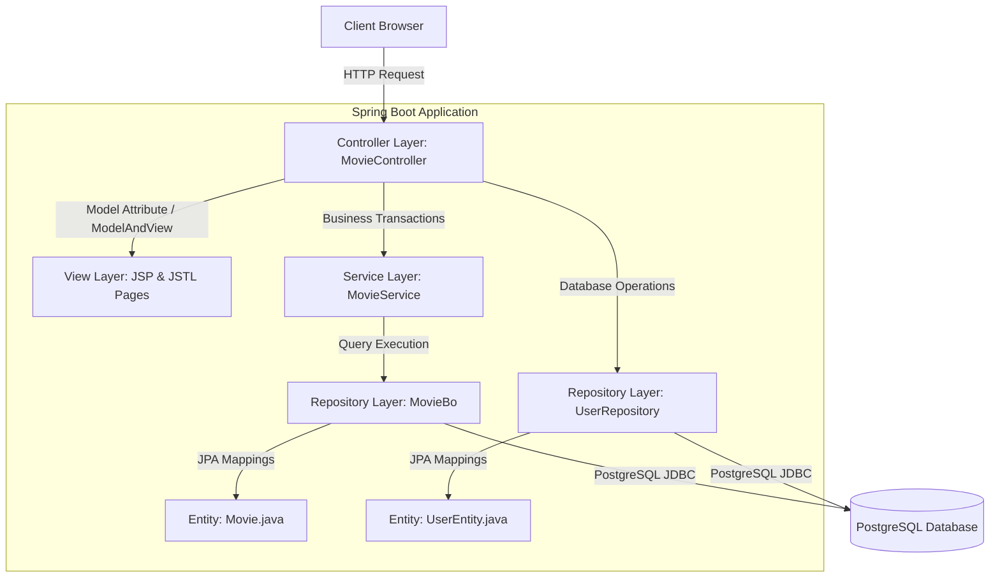

# 🎬 Movie Ticket Admin Portal (movieadminportal)

An enterprise-grade Spring Boot portal designed to manage movies, theater allocations, and user login authentications. Built with a layered architecture, the backend uses **Java 17**, **Spring Data JPA**, and **PostgreSQL** for database storage, while rendering dynamic web templates via **JSP (JavaServer Pages) & JSTL (Jakarta Standard Tag Library)**.

---

## 🏗️ System Architecture & Layered Layout

The application isolates concerns across separate layers, coordinating requests from the client to the database engine:



### 1. Model Entities (`entity/`)
Maps the database tables using Jakarta Persistence (JPA) annotations:
- **`Movie.java`**: Represents movie details (`id`, `mname` [Movie Name], `lang` [Language], `director`, `rdate` [Release Date]).
- **`UserEntity.java`**: Represents user accounts (`email` [Primary Key], `gender`, `location`, `name`, `password`, `role`).

### 2. Repository Layer (`repository/`)
- **`MovieBo.java`**: Extends `JpaRepository<Movie, Integer>` to handle SQL queries for movie objects.
- **`UserRepository.java`**: Extends `JpaRepository<UserEntity, String>` to handle user logins and profiles.

### 3. Service Layer (`service/`)
- **`MovieService.java`**: Coordinates database transactions for movies, implementing operations to add, view, update, delete, retrieve languages, or query movies by specific language parameters.

### 4. Controller Layer (`controller/`)
- **`MovieController.java`**: A `@RestController` routing requests and returning `ModelAndView` objects pointing to JSP templates:
  - **Auth**: `/register`, `/insertUser` (signs up a new user); `/login`, `/checkUser` (authenticates accounts).
  - **Movie CRUD**: `/addmovie`, `/insertMovie` (saves new movies); `/viewmovies` (displays catalog); `/updatemovie`, `/updatemoviedetails` (modifies movie records); `/deletemovie` (deletes movies by ID).
  - **Filters**: `/viewlanguages` (lists unique languages); `/viewmoviesbylang` (filters catalog).

---

## 🛠️ Technology Stack
- **Framework**: Spring Boot `3.5.3` (Starter Web, JPA, DevTools)
- **Language Compiler**: Java `17`
- **Build Tool**: Maven (`pom.xml` packaged as `war`)
- **Template Engine**: JSP (JavaServer Pages) & JSTL (Jakarta Standard Tag Library)
- **Embedded Web Server**: Tomcat (`tomcat-embed-jasper`)
- **Database Engine**: PostgreSQL
- **Container Engine**: Docker

---

## 📂 Project Directory Structure
```bash
├── src/
│   ├── main/
│   │   ├── java/com/example/booking/
│   │   │   ├── controller/
│   │   │   │   └── MovieController.java     # Page router and endpoint controller
│   │   │   ├── entity/
│   │   │   │   ├── Movie.java               # JPA Movie database model
│   │   │   │   └── UserEntity.java          # JPA User accounts model
│   │   │   ├── repository/
│   │   │   │   ├── MovieBo.java             # JPA Movie database operations
│   │   │   │   └── UserRepository.java      # JPA User database operations
│   │   │   ├── service/
│   │   │   │   └── MovieService.java        # Movie business transaction service
│   │   │   └── BookingApplication.java      # Application bootstrap class
│   │   ├── resources/
│   │   │   └── application.properties       # Database, JPA, & server configuration
│   │   └── webapp/
│   │       └── WEB-INF/jspfiles/            # JSP templates directory
│   │           ├── index.jsp                # Landing homepage
│   │           ├── login.jsp / register.jsp # Authorization templates
│   │           ├── addmovie.jsp             # Entry form for new movies
│   │           ├── updatemovie.jsp          # Modification form
│   │           ├── viewmovies.jsp           # Catalog dashboard list
│   │           ├── viewlanguages.jsp        # Languages dashboard
│   │           └── success.jsp / error.jsp  # Status response templates
├── Dockerfile                              # Multi-stage WAR container pipeline
└── pom.xml                                 # Maven configuration definitions
```

---

## 🚀 Setup & Installation Guide

You can run this application locally either via Maven or in a Docker container.

### 1. Database Configuration
Ensure you have a running PostgreSQL database server.
1. Create a schema:
   ```sql
   CREATE DATABASE movies;
   ```
2. Configure credentials in [application.properties](file:///C:/Users/acer/.gemini/antigravity/scratch/movieadminportal/src/main/resources/application.properties) or set the environment variables:
   ```properties
   spring.datasource.url=jdbc:postgresql://localhost:5432/movies
   spring.datasource.username=YOUR_POSTGRES_USERNAME
   spring.datasource.password=YOUR_POSTGRES_PASSWORD
   ```

---

### 2. Running Locally with Maven

Build and run the project:
```bash
# Compile and build executable WAR
./mvnw clean package

# Run the packaged application WAR
java -jar target/booking-0.0.1-SNAPSHOT.war
```
Navigate to [http://localhost:8084](http://localhost:8084) in your browser.

---

### 3. Deploying with Docker Container

The project includes a multi-stage [Dockerfile](file:///C:/Users/acer/.gemini/antigravity/scratch/movieadminportal/Dockerfile) that compiles and runs the application in a lightweight JRE environment:

1. **Build the Docker Image**:
   ```bash
   docker build -t movie-portal .
   ```
2. **Run the Container**:
   Pass your local host database credentials to the Docker container:
   ```bash
   docker run -p 8084:8084 \
     -e SPRING_DATASOURCE_URL=jdbc:postgresql://host.docker.internal:5432/movies \
     -e SPRING_DATASOURCE_USERNAME=postgres \
     -e SPRING_DATASOURCE_PASSWORD=postgres \
     -e PORT=8084 \
     movie-portal
   ```
3. Open [http://localhost:8084](http://localhost:8084) to view the running container.
